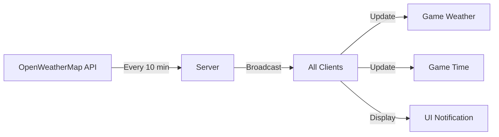

# Nevera Realtime Weather v1.0.1 ⛈️

[](https://github.com/Nevera-Hard-Rp/Nevera-realtime-weather)
[](LICENSE)
[](https://fivem.net)
[](https://github.com/Nevera-Hard-Rp/Nevera-realtime-weather)

A lightweight FiveM script that synchronizes real-world weather and time in-game using OpenWeatherMap API data. Designed for realistic roleplay servers that want authentic weather conditions without admin controls.

## 🎯 Purpose & Philosophy

This script was created for **Nevera Hard RP Server** with a specific philosophy:
- **Real-world simulation only** - No admin commands or manual weather control
- **Immersive roleplay** - Weather matches real-world conditions for enhanced realism
- **Zero intervention** - Set it and forget it, no admin management needed
- **Performance first** - Optimized to 0.00ms idle resource usage

**Note:** This script intentionally does NOT include admin commands for changing weather/time. If you need manual weather control, use additional scripts alongside this one.

## ✨ Features

- **Real-time Weather Sync** - Fetches actual weather data from any city worldwide
- **Automatic Time Sync** - Game time matches real-world time with timezone support
- **Ultra-Lightweight** - 0.00ms idle, 0.01ms active resource usage
- **Smart Display System** - Shows weather info for 15 seconds after updates
- **Wind Dynamics** - Real wind speed affects game environment
- **10-Minute Updates** - Balanced between accuracy and API usage
- **No Dependencies** - Works standalone without any framework

## 📊 Performance Metrics

| State | v1.0.0 | v1.0.1 | Improvement |
|-------|--------|--------|-------------|
| **Idle** | 0.02ms | 0.00ms | 100% |
| **Active** | 0.10ms | 0.01ms | 90% |
| **Memory** | ~1MB | <500KB | 50% |

## 🖼️ Preview Images

### Data Synchronization
Shows real-time data fetching from OpenWeatherMap API:


### Data Update Notification
In-game notification when weather updates:


### Resource Monitor Performance
Optimized to 0.00ms idle performance:


### Clock & Weather Display
Shows time, weather condition and wind speed:


### Weather Examples

#### Rainy Weather
Realistic rain effects with wet roads and reduced visibility:


#### Clear/Sunny Weather
Beautiful clear skies with realistic sun positioning:


## 🚀 Installation

### Step 1: Download
Place the `Nevera-realtime-weather` folder in your server's `resources` directory.

### Step 2: Get API Key
1. Visit [OpenWeatherMap](https://openweathermap.org/)
2. Create a free account
3. Go to API Keys section
4. Generate and copy your key

### Step 3: Configure
Add to your `server.cfg`:

```cfg
# Resource
ensure Nevera-realtime-weather

# Required Settings
set weather_api_key "YOUR_API_KEY_HERE"
set weather_city "Split"                    # Any city name
set weather_timezone "Europe/Zagreb"        # Your timezone

# Optional Settings
set weather_update_interval "600000"        # Update interval in ms (default: 10 min)
set weather_disable_fog "false"            # Disable fog weather
set weather_debug "false"                  # Debug mode for troubleshooting
```

### Step 4: Restart
Restart your server or run `ensure Nevera-realtime-weather`

## ⚙️ Configuration

| Variable | Description | Default | Required |
|----------|-------------|---------|----------|
| `weather_api_key` | OpenWeatherMap API key | - | ✅ Yes |
| `weather_city` | City for weather data | `Split` | ✅ Yes |
| `weather_timezone` | Timezone for time sync | `Europe/Zagreb` | ✅ Yes |
| `weather_update_interval` | Update frequency (ms) | `600000` | ❌ No |
| `weather_disable_fog` | Disable fog weather | `false` | ❌ No |
| `weather_debug` | Enable debug output | `false` | ❌ No |

## 🌍 Supported Weather Types

| Real Weather | Game Weather | Description |
|--------------|--------------|-------------|
| Clear | CLEAR | Clear skies |
| Clouds | CLOUDS | Cloudy weather |
| Rain | RAIN | Rainy conditions |
| Drizzle | CLEARING | Light rain |
| Thunderstorm | THUNDER | Storm with lightning |
| Snow | XMAS | Snow weather |
| Fog/Mist | FOGGY | Foggy conditions (can be disabled) |

## 📈 How It Works



1. Server fetches real weather data every 10 minutes
2. Data is broadcast to all connected players
3. Clients update their local weather and time
4. Notification appears for 15 seconds showing current conditions
5. Script goes idle (0.00ms) until next update

## 🔧 Exports (v1.0.1)

```lua
-- Client-side
exports['Nevera-realtime-weather']:getCurrentWeather()  -- Returns current weather string
exports['Nevera-realtime-weather']:getCurrentTime()      -- Returns {hour, minute}
exports['Nevera-realtime-weather']:getWindSpeed()        -- Returns wind speed

-- Server-side  
exports['Nevera-realtime-weather']:forceUpdate()         -- Force weather update
exports['Nevera-realtime-weather']:getLastUpdate()       -- Get last update timestamp
```

## 🎮 For Players

Players will see:
- Weather notification in top-left corner after each update
- Current time displayed as `Hour: HH:MM`
- Current weather condition
- Wind speed in m/s

The display automatically disappears after 15 seconds to maintain immersion.

## 🛠️ Troubleshooting

### Weather not updating?
- Check API key is valid
- Verify city name exists in OpenWeatherMap
- Enable debug mode: `set weather_debug "true"`

### Wrong time displayed?
- Verify timezone format (e.g., `Europe/London`, `America/New_York`)
- Check [timezone list](https://en.wikipedia.org/wiki/List_of_tz_database_time_zones)

### High resource usage?
- Increase update interval: `set weather_update_interval "1200000"` (20 min)
- Verify you're using v1.0.1 (check fxmanifest.lua)

## 📝 Changelog

### v1.0.1 (Current)
- **Optimized to 0.00ms idle performance**
- Removed constant rendering loop
- Added event-driven display system
- Implemented smart caching
- Added exports for integration
- Improved error handling
- Added debug mode

### v1.0.0
- Initial release
- Basic weather synchronization
- Time synchronization
- Simple UI display

## 🤝 Credits

- **Created by:** Nevera Development Team
- **For:** Nevera Hard RP Server
- **API:** OpenWeatherMap
- **Platform:** FiveM/Cfx.re

## 📄 License

MIT License - See [LICENSE](LICENSE) file for details

## ⚠️ Important Notes

1. **No Admin Controls:** This script does not include commands to manually change weather/time. This is by design for realistic RP servers.

2. **API Limits:** Free OpenWeatherMap tier allows 1,000 calls/day (enough for 100+ player server)

3. **Compatibility:** Works with any framework (ESX, QBCore, standalone) as it requires no dependencies

4. **Support:** For issues, please open a ticket on [GitHub Issues](https://github.com/Nevera-Hard-Rp/Nevera-realtime-weather/issues)

## 🔗 Links

- [GitHub Repository](https://github.com/Nevera-Hard-Rp/Nevera-realtime-weather)
- [FiveM Forum Post](https://forum.cfx.re/t/free-nevera-realtime-weather-and-clock-script/5283767)
- [OpenWeatherMap API](https://openweathermap.org/api)
- [Nevera Hard RP Discord](https://discord.gg/nevera)

---
*Made with ❤️ in Split, Croatia for realistic roleplay servers worldwide*
