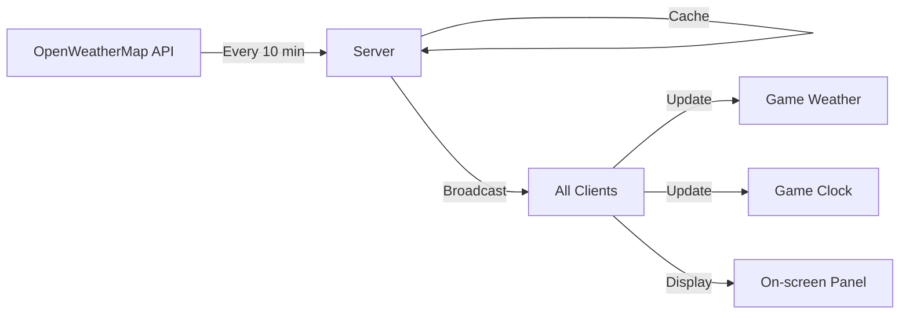

# Nevera Realtime Weather & Clock

<div align="center">
  
</div>

[](https://github.com/Nevera-Hard-Rp/Nevera-realtime-weather)
[](LICENSE)
[](https://fivem.net)
[](https://github.com/Nevera-Hard-Rp/Nevera-realtime-weather)

A lightweight FiveM script that synchronizes **real-world weather and time**
in-game using OpenWeatherMap data. Built for roleplay servers that want
authentic conditions instead of randomly cycling weather.

Pick a city anywhere on the planet. If it's raining there, it rains on your
server. If the sun sets at 20:41, it sets at 20:41 in game.

---

## 🎯 Philosophy

- **Real-world simulation first** — the weather is not random, it is real
- **Zero player intervention** — players cannot change anything
- **Admin control when you need it** — one command for events, then it returns
  to reality on its own
- **Lightweight** — one API call per server, no per-player polling, no render
  loop while the panel is hidden

---

## ✨ Features

- **Worldwide** — any city, any timezone, no timezone configuration
- **Automatic DST** — summer and winter time come from the API
- **Drift-free clock** — synchronized every second against real time
- **Detailed weather mapping** — around 40 OpenWeatherMap condition IDs mapped
  individually, so drizzle, moderate rain and a thunderstorm each look different
- **Smooth transitions** — the sky fades between states over 15 seconds
- **Real wind direction** — wind follows the actual bearing from the API
- **Snow effects** — tyre trails and footprints enable automatically
- **On-screen panel** — time, conditions, temperature and wind, top-left
- **Admin override** — force any weather type for a set duration, with automatic
  return to real conditions
- **Resilient** — retries on failure, keeps last known data, re-reads its config
  every cycle, explains errors in plain English
- **No dependencies** — ESX, QBCore, QBox or standalone

---

## 🖼️ Preview

**On-screen panel** — time, conditions, temperature and wind direction

<!-- TODO: replace panel preview with 4-line temp+wind screenshot -->


**Rain**


**Clear**


**Console output on sync**


**Resource monitor**


---

## 📦 Requirements

- FiveM server artifacts supporting `fx_version 'cerulean'`
- A free [OpenWeatherMap](https://openweathermap.org/) API key
- Outbound HTTPS access from your server

---

## 🚀 Installation

**1.** Download and place the folder in your `resources` directory.

**2.** Get an API key:

- Register at [OpenWeatherMap](https://openweathermap.org/)
- Open the **API keys** section of your profile
- Generate a key

> ⚠️ A brand new key can take **up to 2 hours** to activate. A `401` right after
> signing up means the key is fine but not live yet — wait and try again.

**3.** Add to `server.cfg`. **Order matters** — see below:

```cfg
# ---- Nevera Realtime Weather ----
set my_sync_key      "YOUR_API_KEY"   # your OpenWeatherMap key
set my_sync_city     "Split"          # city name
set my_sync_country  "HR"             # ISO country code
set my_sync_interval "10"             # minutes between API calls
set my_sync_display  "15000"          # panel duration in ms, 0 = never show
set disable_fog      "true"           # "false" to allow fog
set my_sync_debug    "false"          # "true" prints the raw API response

# admin permission for the weather commands
add_ace group.admin nevera.weather allow

ensure Nevera-realtime-weather
```

**4.** Start the server and watch the console. A successful sync looks like this:

```
[nevera-weather] Split: Clouds, 29.6 C, wind 1.6 m/s from 228 deg
```

### Config ordering

`set` lines must come **before** `ensure`. If a resource starts before its
convars exist, it reads empty values — which looks exactly like a bad API key.

```cfg
exec aceperms.cfg                    # 1. permissions
set my_sync_key "YOUR_API_KEY"       # 2. convars
ensure Nevera-realtime-weather       # 3. resources
```

Since 1.0.2 this can't break the resource permanently — config is re-read on
every cycle, so a misordered `server.cfg` costs you one failed request and
recovers 30 seconds later. The clean order still saves you the confusion.

---

## ⚙️ Configuration

| Convar | Default | Description |
|---|---|---|
| `my_sync_key` | *(empty)* | OpenWeatherMap API key. **Required.** |
| `my_sync_city` | `Split` | City name. Spaces and accents are handled. |
| `my_sync_country` | `HR` | ISO 3166 country code. Prevents matching the wrong city. |
| `my_sync_interval` | `10` | Minutes between API calls. |
| `my_sync_display` | `15000` | How long the panel stays on screen, in ms. `0` hides it entirely. |
| `my_sync_tzoffset` | *(auto)* | Manual UTC offset **in seconds**. Only set this if the automatic value is wrong. |
| `disable_fog` | `true` | Replaces fog with overcast. Useful where fog is rare. |
| `my_sync_debug` | `false` | Prints the full API response to console. |

Older names are also accepted, so an existing `server.cfg` keeps working:
`weather_api_key`, `weather_city`, `weather_disable_fog`, `weather_debug`, and
`weather_update_interval` (milliseconds, converted automatically).

Because config is re-read every cycle, you can change settings live from the
console — `set my_sync_city "Zagreb"` takes effect on the next update.

### Choosing a city

Always pair the city with a country code. `Split,HR` is Split in Croatia —
without `HR` the API may return a different Split entirely. Same for
`San Juan,PR`, `Tallahassee,US`, `Valencia,ES`.

The timezone is derived from the API response for that city, so **you never
configure a timezone**. Set the city correctly and the clock is correct.

### Keep your key private

Your API key grants access to your quota. Don't commit it, don't show it on
stream, and remember that typing `my_sync_key` in the console prints it in
plain text. If a key is ever exposed, delete it in your OpenWeatherMap profile
and generate a new one.

---

## 🛠️ Admin Commands

All three require the `nevera.weather` ACE permission and also work from the
server console.

| Command | Description |
|---|---|
| `/setweather <TYPE> [minutes]` | Force a weather type. Default 30 minutes, max 720. |
| `/resetweather` | Cancel the override immediately and resync. |
| `/weatherstatus` | Show real conditions and override state. |

**Available types:**
`CLEAR` `EXTRASUNNY` `CLOUDS` `OVERCAST` `CLEARING` `RAIN` `THUNDER`
`FOGGY` `SMOG` `SNOW` `SNOWLIGHT` `BLIZZARD` `XMAS` `NEUTRAL` `HALLOWEEN`

**Examples:**

```
/setweather BLIZZARD 45
/setweather FOGGY
/resetweather
```

While an override is active, real-time sync pauses and the on-screen panel
shows which admin set it, so players know the weather isn't real. When the
timer expires the script fetches fresh data and returns to reality on its own.

### Granting permission

```cfg
# by group
add_principal identifier.license:YOUR_LICENSE group.admin
add_ace group.admin nevera.weather allow

# or directly to one person
add_ace identifier.license:YOUR_LICENSE nevera.weather allow
```

> **QBCore users:** being an admin in QBCore does **not** grant ACE permissions
> — they are two separate systems. You must be in `group.admin` via
> `add_principal`, or hold the ACE directly. Verify with `list_principals` and
> `list_aces` in the server console.

Keep `add_ace` and `add_principal` lines — and the `exec` line of any file
containing them — **above** your `ensure` lines.

> The clock deliberately has no override. Players build their roleplay around
> the time of day, and jumping from 03:00 to midday breaks that for everyone
> at once.

---

## 📈 How It Works


```mermaid
graph LR
    A[OpenWeatherMap API] -->|Every 10 min| B[Server]
    B -->|Cache| B
    B -->|Broadcast| C[All Clients]
    C -->|Update| D[Game Weather]
    C -->|Update| E[Game Clock]
    C -->|Display| F[On-screen Panel]
```

1. The server polls the API on its own schedule and caches the result
2. Data is broadcast to every connected player
3. Players joining mid-cycle receive the cached data immediately
4. Clients apply weather, wind and time, and show the panel briefly
5. The script idles until the next cycle

### What the game can and can't do

- **Snow has no intensity levels.** GTA either has snow-covered terrain or it
  doesn't — 2 cm and half a metre look identical. Only the falling density and
  visibility change.
- **Wind is visual.** Trees, dust, cloth and water react to it. Vehicles do not.
- **Temperature is display only.** It has no gameplay effect unless another
  resource reads it through the exports.

---

## 🌍 Translating the on-screen panel

Open `realtime_client.lua`. The first two tables at the top of the file are all
you need:

```lua
local LABELS = {
    time    = "Time",
    weather = "Weather",
    temp    = "Temp",
    wind    = "Wind",
    forced  = "Forced by admin"
}

local conditionNames = {
    Clear  = "Clear",
    Clouds = "Cloudy",
    Rain   = "Rain",
    -- ...
}
```

Change the **right-hand side** only. The keys in `conditionNames` are the values
the API sends — leave them exactly as they are.

### Moving the panel

In the render loop, `local y = 0.045` is the vertical starting point and
`DrawText(0.015, y)` the horizontal one. Lower `y` moves the panel up, raise it
to clear an FPS counter or another HUD element.

---

## 🔌 Exports

**Client:**

```lua
exports['Nevera-realtime-weather']:getCurrentWeather()   -- string, e.g. "Rain"
exports['Nevera-realtime-weather']:getCurrentTime()      -- { hour, minute, second }
exports['Nevera-realtime-weather']:getWindSpeed()        -- number, m/s
exports['Nevera-realtime-weather']:getTemperature()      -- number, Celsius
exports['Nevera-realtime-weather']:getWindDirection()    -- string, e.g. "NE"
```

**Server:**

```lua
exports['Nevera-realtime-weather']:getWeatherCache()     -- full cached table
exports['Nevera-realtime-weather']:isOverrideActive()    -- boolean
exports['Nevera-realtime-weather']:forceUpdate()         -- trigger a fetch now
exports['Nevera-realtime-weather']:getLastUpdate()       -- unix timestamp
```

---

## 📊 Performance

| State | Cost |
|---|---|
| Panel hidden | **0.00 ms** |
| Panel visible | 0.01–0.03 ms |

Set `my_sync_display "0"` for a constant 0.00 ms with no panel at all.

The server makes **one** API call per interval regardless of player count. At
the default 10 minutes that is roughly 4,300 calls per month, comfortably
inside the free tier.

---

## 🧩 Troubleshooting

| Symptom | Cause and fix |
|---|---|
| `status 0` | The request never left your server. Check outbound HTTPS, firewall, and update your artifacts. |
| `status 401` | Bad key, or a new key that hasn't activated yet — wait up to 2 hours. If the key works in a browser but not on the server, see the row below. |
| `401` on boot, works after `restart` | Your `set` lines sit below `ensure` in `server.cfg`. Move them above. The resource recovers on its own within 30 seconds, but fix the order anyway. |
| `status 404` | Wrong city or country code. Verify the pair works in a browser first. |
| `status 429` | Quota exceeded. Increase `my_sync_interval`. |
| Clock off by hours | Wrong city — the timezone follows the city. Set `my_sync_country`, or override with `my_sync_tzoffset`. |
| No fog ever appears | That is `disable_fog "true"`. Set it to `"false"`. |
| Panel never shows | `my_sync_display` is `0`, or the API hasn't responded yet. |
| Panel overlaps another HUD | Raise `local y` in the render loop. See *Moving the panel*. |
| Weather won't stay | Another weather script is fighting for the same natives. Run one or the other. |
| Admin command denied | ACE lines must load before `ensure`. QBCore admin status is separate — see *Granting permission*. |

### Verify the script independently of permissions

Commands run from the **server console** skip the permission check, so you can
confirm the script works before sorting out ACE:

```
weatherstatus
```

No slash — the console is not chat.

### Check what the server actually loaded

Type the convar name alone in the server console, **without** `set`:

```
my_sync_key
```

Typing `set my_sync_key` with no value clears it until the next restart.

### Verify your key directly

```
https://api.openweathermap.org/data/2.5/weather?q=Split,HR&appid=YOUR_KEY&units=metric
```

If the browser returns JSON but the server returns `401`, the problem is your
`server.cfg` — not the key.

Set `my_sync_debug "true"` to print the full API response to console.

---

## 🤝 Credits

- **Created by:** Nevera
- **For:** Nevera Hard RP Server
- **Weather data:** [OpenWeatherMap](https://openweathermap.org/)
- **Platform:** FiveM / Cfx.re

Thanks to **@TheAgentDap**, **@Patronum_Studio**, **@Jota.Fivem** and
**@SrKaiross** for feedback on the forum thread.

## 📄 License

MIT — see [LICENSE](LICENSE).

## 🔗 Links

- [Changelog](CHANGELOG.md)
- [GitHub Repository](https://github.com/Nevera-Hard-Rp/Nevera-realtime-weather)
- [Cfx.re Forum Thread](https://forum.cfx.re/t/free-nevera-realtime-weather-and-clock-script/5283767)
- [OpenWeatherMap Current Weather API](https://openweathermap.org/current)
- [OpenWeatherMap Condition Codes](https://openweathermap.org/weather-conditions)
- [Nevera Hard RP Discord](https://discord.gg/k7uADMdFes)

---

*Made in Split, Croatia.*
